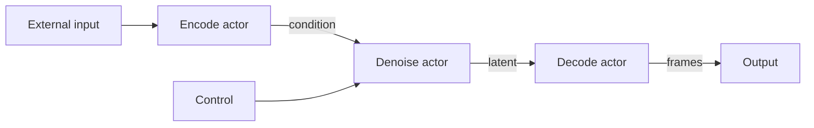
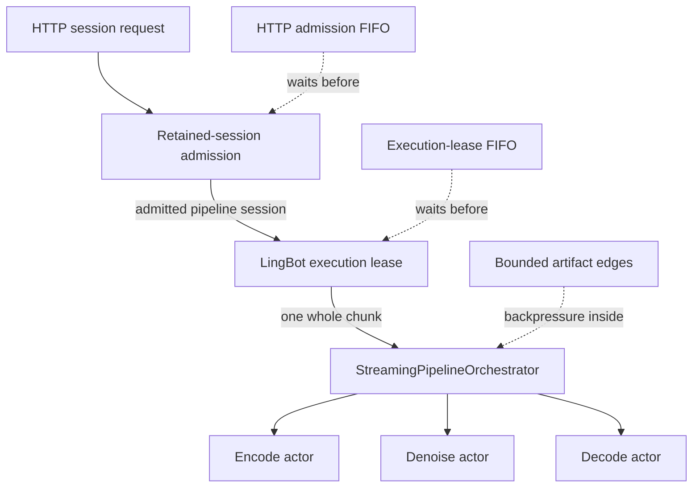

# Streaming Pipeline Scheduler

## Purpose

`StreamingPipelineOrchestrator` coordinates long-running, stateful generation pipelines whose work arrives and
completes as ordered chunks. It is intended for interactive workloads such as LingBot, where new control input can
arrive while earlier chunks are encoding, denoising, or decoding.

The scheduler is distinct from `FlexiblePipelineOrchestrator`. The flexible orchestrator coordinates request-level
stage groups; the streaming scheduler owns bounded, per-session dataflow and persistent stage actors.

## Architecture

The scheduler executes a directed acyclic graph of typed artifacts:



Each logical stage is represented by one long-lived actor. Independent actors may run concurrently even when their
workers use the same physical GPU. CUDA device placement alone does not imply serialization or resource ownership.

| Component | Responsibility |
| --- | --- |
| `StreamingStageSpec` | Declares stage inputs, outputs, ordering, admission limits, and an optional resource group. |
| `StreamingEdgeSpec` | Declares a bounded artifact path and its per-session capacity. |
| `StreamingPipelineSpec` | Defines the complete graph, outputs, and resource groups. |
| `LocalStageActor` | Serializes execution for one local state-owning stage. |
| `ParallelWorkerStageActor` | Gives one `ParallelWorker` a single actor owner. |
| `StreamingPipelineOrchestrator` | Validates the graph and schedules ready sequence items across sessions. |

## Dataflow and Ordering

Every input, intermediate artifact, and output is associated with a session ID and sequence ID. The default
`StageOrdering.PER_SESSION_STRICT` preserves the causal order of state mutations within a session while allowing fair
interleaving between sessions.

Edges and outputs have explicit capacities. When a downstream stage cannot accept more work, the scheduler applies
backpressure rather than retaining unbounded tensors. Pipeline implementations must therefore treat submission as
admission-controlled, not as an unbounded queue.

## Relationship to stream-service scheduling

The [Stream Server Guide](stream_server.md) owns room, admission, and user-facing lifecycle semantics. This guide
starts after a pipeline session has been admitted. Three schedulers operate at different boundaries and must not be
treated as one queue:



| Boundary | Owner | Purpose |
| --- | --- | --- |
| Retained-session admission | LiveKit runtime | Assign an HTTP session to capacity on a model worker, or place it in the bounded HTTP admission queue. |
| Cross-session model execution | LingBot service instance | Grant one execution lease so only one retained LingBot session submits a whole chunk at a time. |
| Intra-pipeline dataflow | `StreamingPipelineOrchestrator` | Schedule encode, denoise, and decode stage work with bounded artifacts and per-session ordering. |

`max_sessions_per_worker` changes only the first boundary. It does not change service-instance count, execution
leases, or graph-edge capacities. The second boundary is a LingBot service policy, not a generic orchestrator
feature: its lease surrounds one session chunk, while the orchestrator may still overlap independent stages within
that chunk. Other `BidirectionalService` implementations define their own cross-session policy.

## LingBot Condition Prefetch

LingBot encodes the bounded reference-image prefix once while initializing the session. A generic
`WorkerTensorChannel` distributes that base latent directly from the VAE encode worker to every DiT rank, where it
remains resident in the session cache. Later condition artifacts contain only `chunk_index` and `chunk_size`; each
rank slices the resident latent, repeats its tail when necessary, and constructs the first-frame mask locally.

The prefix bound comes from the instantiated Wan VAE encoder topology rather than a fixed frame count. Its temporal
receptive field and sampling stride identify the first latent that is independent of the reference image. The default
topology retains latent frames 0 through 29, then safely repeats latent 29 for the remainder of a long session. Shorter
requests retain their complete condition sequence.

The session keeps a fixed lookahead of two condition metadata artifacts independently of control admission:

- Session startup admits `condition[0]` and `condition[1]` when bounded ingress has capacity.
- After denoise completes for chunk `i`, the session refills the window, normally with `condition[i+2]`.
- `next_condition_index` and `next_control_index` maintain
  `0 <= next_condition_index - next_control_index <= 2`.
- If backpressure prevented prefetch, the next control and its missing condition request are admitted atomically.

Conditions and controls still join by session and sequence ID before denoise. The lookahead optimization changes
scheduling, not causal cache ownership. `latency_anchor_artifact="control"` ensures condition-only
prefetch does not start the control-to-output timer.

This model-specific policy sits above the generic scheduler. Edge capacities bound in-flight metadata while retained
session capacity includes the resident condition latent, and cleanup still runs through the owning actors.

## Actor Ownership and Session Lifecycle

A state-owning stage worker has exactly one actor owner for its entire lifetime. This pipeline-level stage worker is
not the stream-server model worker that owns retained-session capacity. In particular, one `ParallelWorker` must
not be invoked directly by a session facade or shared by multiple stage actors. This preserves result ordering and
ensures that cache mutation and release occur in one well-defined execution context.

Session shutdown is ordered as follows:

1. Stop admitting new work.
2. Drain or cancel accepted work according to the session policy.
3. Release stage-owned state in reverse topological order through the owning actors.
4. Release scheduler artifact references and verify that no capacity slots remain allocated.
5. Record cleanup failures and do not reuse partially released state.

LingBot uses this lifecycle for offline chunked generation and bidirectional LiveKit sessions. Transport reconnects
never transfer actor-owned stage state between workers.

## Resource Groups and Placement

`StreamingResourceGroupSpec` represents an explicit shared concurrency constraint. A stage participates only when
its `StreamingStageSpec.resource_group` names a group declared by `StreamingPipelineSpec.resource_groups`.

Do not infer a resource group from `device_id` or `ParallelConfig.device_ids`. LingBot VAE encode remains an
independent actor. When distributed DiT and VAE decode use exactly the same device list and world size, the pipeline
explicitly co-locates the decoder in the DiT worker group to reuse CUDA contexts; non-matching placements remain
independent actors. If a placement exceeds memory capacity, move stages to different devices or define a deliberate
deployment constraint; do not add an implicit global mutex.

LingBot uses independent `vae_encode_config` and `vae_decode_config`. Each VAE
stage receives its own complete `ModelRuntimeConfig`; there is no shared VAE
placement fallback.

When distributed DiT and VAE decode use different worker groups, LingBot connects their latent edge with a generic
`WorkerTensorChannel`. The denoising worker sends CUDA IPC handles directly to the decode ranks and returns only
validated tensor metadata to the scheduler. The parent process therefore retains bounded artifact ownership and
ordering without materializing the latent or allocating copies on the decode GPUs.

## Observability and Real-Time Operation

`StreamingSessionMetrics` records scheduler-observed timing and lifecycle data, including:

| Signal | Operational use |
| --- | --- |
| First-output latency | Time from first accepted ingress to first emitted output. |
| Control-to-output latency | Time from an accepted control/input to its corresponding output. |
| Chunk period | Cadence between consecutive output chunks. |
| Stage timing | Input-ready, admitted, and completed timestamps for each invocation. |
| Idle intervals | Admission gaps and their blocking reason. |
| Diagnostics | Stale, orphaned, duplicate, cleanup-failure, and slot-leak counters. |

For real-time operation, compare p95 chunk period with the media duration represented by a chunk:

```text
real-time factor = p95 chunk period / chunk media duration
```

A value below one indicates that generation normally stays ahead of playback. Production capacity planning must still
reserve margin for encoding, transport, and scheduling jitter.

## Integration Requirements

When integrating a streaming pipeline:

- Keep model-specific preprocessing and cache behavior outside the generic scheduler.
- Give every state-owning worker exactly one actor owner.
- Define a bounded edge for every tensor-bearing artifact path.
- Preserve session and sequence IDs from ingress through output.
- Isolate session state and release it through the owning actor.
- Declare resource groups only for real, explicit deployment constraints.
- Validate interleaved sessions, backpressure, cancellation, actor failures, and cleanup failures.
