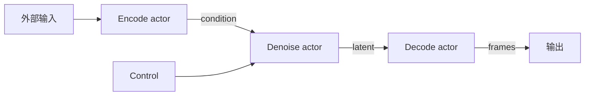
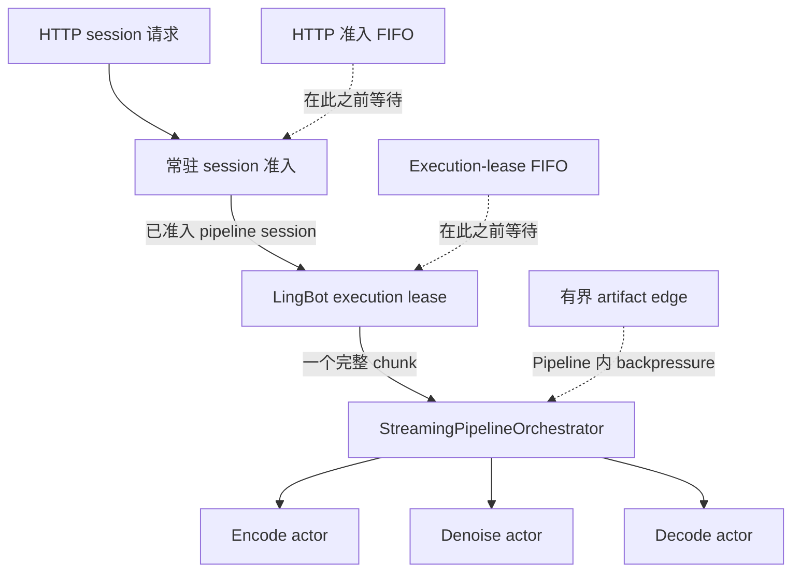

# 流式 Pipeline 调度器

## 目的

`StreamingPipelineOrchestrator` 用于协调按顺序 chunk 执行的长时、有状态生成管线。它适用于 LingBot 一类的
交互式任务：较早 chunk 仍在 encode、denoise 或 decode 时，后续 control 输入可以持续进入。

该调度器与 `FlexiblePipelineOrchestrator` 职责不同。后者协调请求级 stage group；流式调度器管理有界的
per-session 数据流和长期存活的 stage actor。

## 架构

调度器执行由带类型 artifact 构成的有向无环图：



每个逻辑 stage 对应一个长期存活的 actor。相互独立的 actor 可以并发执行，即使其 worker 使用同一张物理 GPU。
CUDA device placement 本身不代表串行执行或资源所有权。

| 组件 | 职责 |
| --- | --- |
| `StreamingStageSpec` | 声明 stage 的输入、输出、顺序、准入上限和可选 resource group。 |
| `StreamingEdgeSpec` | 声明有界 artifact 路径及其 per-session 容量。 |
| `StreamingPipelineSpec` | 定义完整图、输出和 resource groups。 |
| `LocalStageActor` | 串行执行一个本地有状态 stage。 |
| `ParallelWorkerStageActor` | 为一个 `ParallelWorker` 提供唯一 actor owner。 |
| `StreamingPipelineOrchestrator` | 校验图并在多个 session 之间调度已就绪的 sequence item。 |

## 数据流与顺序

每个输入、中间 artifact 和输出都关联 session ID 与 sequence ID。默认的
`StageOrdering.PER_SESSION_STRICT` 保证单个 session 内有状态更新的因果顺序，同时允许不同 session 公平交错。

edge 和输出均有显式容量。下游 stage 无法继续接收任务时，调度器施加 backpressure，而不是无限保留 tensor。
因此管线实现必须把提交视为受准入控制的操作，而不是无界队列。

## 与流服务调度的关系

[流式服务指南](stream_server.md)负责 room、准入和面向用户的生命周期语义；本文从 pipeline session 已准入
之后开始。系统中有三个边界不同的 scheduler，不能把它们视为同一条队列：



| 边界 | 所有者 | 用途 |
| --- | --- | --- |
| 常驻 session 准入 | LiveKit runtime | 把 HTTP session 分配到模型 worker 的容量，或放入有界 HTTP 准入队列。 |
| 跨 session 模型执行 | LingBot 服务实例 | 授予唯一 execution lease，使常驻 LingBot session 每次只提交一个完整 chunk。 |
| Pipeline 内数据流 | `StreamingPipelineOrchestrator` | 以有界 artifact 和 per-session 顺序调度 encode、denoise、decode stage。 |

`max_sessions_per_worker` 只改变第一层边界，不改变服务实例数、execution lease 或 graph edge capacity。
第二层是 LingBot 服务策略，不是通用 orchestrator 能力：lease 包围一个 session chunk，而 orchestrator 仍可让
该 chunk 内的独立 stage 相互重叠。其他 `BidirectionalService` 实现需要自行定义跨 session 策略。

## LingBot Condition 预取

LingBot 在 session 初始化时只编码一次有界的参考图前缀。通用 `WorkerTensorChannel` 将基础 latent 从 VAE
encode worker 直接分发到每个 DiT rank，并常驻在对应 session cache。后续 condition artifact 只包含
`chunk_index` 和 `chunk_size`；每个 rank 本地切片、按需重复尾部 latent，并生成首帧 mask。

前缀上限由实例化的 Wan VAE encoder 拓扑推导，而不是使用固定帧数。根据时间感受野与采样步长，可以找到
第一个不再依赖参考图的 latent。默认拓扑保留 latent 0 到 29，长 session 随后可以安全复用 latent 29；
较短的请求则保留完整 condition 序列。

session 对 condition metadata 保持固定深度为 2 的 lookahead，且不依赖 control 准入：

- session 启动时，在有界 ingress 有容量的前提下提交 `condition[0]` 和 `condition[1]`；
- chunk `i` 的 denoise 完成后补满窗口，正常情况下提交 `condition[i+2]`；
- `next_condition_index` 与 `next_control_index` 始终满足
  `0 <= next_condition_index - next_control_index <= 2`；
- 若 backpressure 导致预取缺失，下一个 control 会与缺失的 condition request 原子准入。

condition 与 control 仍按 session 和 sequence ID 在 denoise 前汇合。lookahead 优化只调整调度，不改变 causal
cache 所有权。`latency_anchor_artifact="control"` 保证单独预取 condition 不会启动 control-to-output 计时。

这一模型专属策略位于通用 scheduler 之上；edge capacity 约束在途 metadata，常驻 condition latent 计入
session capacity，session 清理仍通过 owning actor 执行。

## Actor 所有权与 Session 生命周期

一个有状态 stage worker 在整个生命周期内只能有一个 actor owner。这里的 pipeline stage worker 不是拥有常驻
session 容量的 stream-server 模型 worker。特别是，一个 `ParallelWorker` 不得由 session facade 直接调用，也
不得被多个 stage actor 共享。该约束保证 result ordering，并让 cache 更新与释放发生在唯一、明确的执行上下文中。

session 关闭按以下顺序执行：

1. 停止接收新任务。
2. 根据 session 策略排空或取消已接收任务。
3. 通过 owning actor 按逆拓扑顺序释放 stage-owned state。
4. 释放 scheduler artifact 引用，并确认没有遗留容量 slot。
5. 记录清理失败；不得复用只完成部分释放的状态。

LingBot 的离线 chunked generation，以及通过 LiveKit 传输的双向 session，均使用此
生命周期。传输层重连不会在 worker 之间迁移 actor-owned stage state。

## Resource Group 与放置

`StreamingResourceGroupSpec` 表示显式的共享并发约束。只有当 `StreamingStageSpec.resource_group` 引用
`StreamingPipelineSpec.resource_groups` 中声明的 group 时，stage 才会参与该约束。

不要根据 `device_id` 或 `ParallelConfig.device_ids` 推断 resource group。LingBot VAE encode 保持为独立
actor。当分布式 DiT 和 VAE decode 使用完全相同的 device list 与 world size 时，pipeline 会把 decoder
co-locate 到 DiT worker group，以复用 CUDA context。若放置超过显存容量，应移动 stage 到其他设备，或声明
明确的部署约束；不要增加隐式的全局互斥锁。

LingBot 的 `vae_encode_config` 和 `vae_decode_config` 是两个独立且完整的
`ModelRuntimeConfig`，不再提供共享的 VAE placement fallback。

当分布式 DiT 和 VAE decode 位于不同 worker group 时，LingBot 使用通用 `WorkerTensorChannel` 连接 latent
edge。Denoising worker 直接向 decode ranks 发送 CUDA IPC handle，只把经过校验的 tensor metadata 返回给
scheduler。主进程仍负责有界 artifact 的 ownership 和顺序，但不再 materialize latent，也不会在 decode GPU
上分配中转副本。

## 可观测性与实时运行

`StreamingSessionMetrics` 记录 scheduler 观测到的时序和生命周期数据，包括：

| 信号 | 运行用途 |
| --- | --- |
| 首帧延迟 | 从首个 ingress 被接收到首个输出发出的时间。 |
| Control-to-output 延迟 | 从 control/input 被接收到对应输出发出的时间。 |
| Chunk period | 相邻输出 chunk 的节奏。 |
| Stage timing | 每次调用的 input-ready、admitted 和 completed 时间。 |
| Idle interval | 准入间隔及其阻塞原因。 |
| Diagnostics | stale、orphaned、duplicate、cleanup failure 和 slot leak 计数。 |

实时运行时，应比较 p95 chunk period 与一个 chunk 代表的媒体时长：

```text
实时系数 = p95 chunk period / chunk 媒体时长
```

小于一表示生成通常快于播放消耗。生产容量规划仍应为编码、传输和调度抖动保留余量。

## 接入要求

接入流式管线时：

- 模型专属预处理和 cache 行为必须保留在通用 scheduler 之外。
- 每个有状态 worker 必须只有一个 actor owner。
- 每条携带 tensor 的 artifact 路径都必须定义有界 edge。
- 从 ingress 到输出持续保留 session ID 和 sequence ID。
- session state 必须隔离，并通过 owning actor 释放。
- 只为真实且明确的部署约束声明 resource group。
- 应验证 session 交错、backpressure、取消、actor failure 和 cleanup failure。
