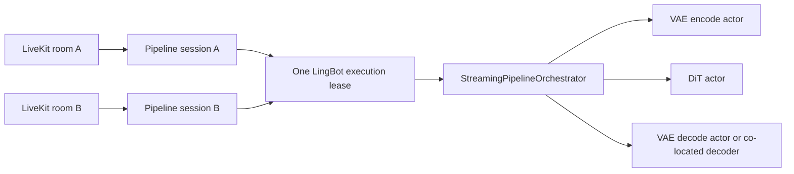

# LingBot-World Examples

Offline image-to-video and interactive WebRTC streaming generation for LingBot-World-Fast (v1) and LingBot-World
v2. Both variants use the shared causal-fast streaming engine; their checkpoint layout and PPL defaults differ.

## Model Directory

Both offline examples require the Wan2.2 I2V base model. v1 and v2 use separate LingBot checkpoint directories:

```text
${TF_MODEL_ZOO_PATH}/
├── Wan2.2-I2V-A14B/
└── lingbot/
    ├── lingbot-world-fast/
    └── lingbot-world-v2-14b-causal-fast/
        └── transformers/
```

Set the model root before running the example:

```bash
export TF_MODEL_ZOO_PATH=/path/to/model_zoo
```

## Validated H100 Development Environment

The four-H100 LingBot-World v2 AIPerf test used the following environment. TeleFuser supports broader
versions through its normal dependency ranges, but performance results in this README should be reproduced with
these versions before attributing a difference to code changes.

| Component | Validated value |
| --- | --- |
| GPU | 4 x NVIDIA H100 80 GB HBM3 (SM90) |
| NVIDIA driver | `590.48.01` |
| Python | `3.11.13` |
| PyTorch | `2.11.0+cu130` |
| PyTorch CUDA runtime | `13.0` |
| FlashAttention 4 | `flash-attn-4==4.0.0b19` |
| CUTLASS DSL | `nvidia-cutlass-dsl==4.6.0` |
| CUDA Python | `cuda-python==13.3.1` |

Create an isolated Python 3.11 environment and install the CUDA 13.0 PyTorch build from the wheel index used by
your deployment. Install PyTorch before TeleFuser so optional CUDA packages resolve against the intended ABI:

```bash
python3.11 -m venv .venv-lingbot
source .venv-lingbot/bin/activate
python -m pip install --upgrade pip setuptools wheel

# Install torch==2.11.0+cu130 from your CUDA 13.0 PyTorch wheel index first.
python -m pip install -e ".[dev]"
python -m pip install \
  "flash-attn-4[cu13]==4.0.0b19" \
  "nvidia-cutlass-dsl==4.6.0" \
  "cuda-python==13.3.1"
```

The `cu13` extra installs FA4's CUDA 13 dependency variant. For a CUDA 12.8 PyTorch environment, install
`flash-attn-4==4.0.0b19` without that extra and use matching CUDA 12.x dependencies; do not mix cu128 and cu130
interpreters in one distributed run.

Verify both the package versions and TeleFuser's runtime backend selection before benchmarking:

```bash
python - <<'PY'
import importlib.metadata as metadata

import torch

from telefuser.ops.attention.backends import FLASH_ATTN_4_AVAILABLE

print("PyTorch:", torch.__version__)
print("PyTorch CUDA:", torch.version.cuda)
print("GPU:", torch.cuda.get_device_name(0))
print("flash-attn-4:", metadata.version("flash-attn-4"))
print("nvidia-cutlass-dsl:", metadata.version("nvidia-cutlass-dsl"))
print("cuda-python:", metadata.version("cuda-python"))
print("TeleFuser FA4 available:", FLASH_ATTN_4_AVAILABLE)
assert FLASH_ATTN_4_AVAILABLE
PY
```

## Feature Support

| Feature | Support |
| --- | --- |
| Offline image-to-video | ✔️ |
| Camera control | ✔️ |
| Continuous chunked generation | ✔️ |
| Single-GPU inference | ✔️ |
| Ulysses Sequence Parallel | ✔️ |
| FSDP | Configurable through PPL_CONFIG |
| H100 optimized attention | v2: FA4, then FA3/SageAttention; v1: SageAttention |

## Files

### lingbot_world_fast_image_to_video_h100.py

Offline generation and stream-server entry point for LingBot-World-Fast with camera control.

Default configuration:

- Resolution: `480p`
- Output frames: `81`
- Frame rate: `16 FPS`
- Chunk size: `3` latent frames
- Seed: `42`
- Control mode: `cam`
- Attention backend: `SAGE_ATTN_2_8_8_SM90`
- Default input: `examples/data/lingbot_world_fast/image.jpg`
- Default control directory: `examples/data/lingbot_world_fast/`
- Default output: `work_dirs/lingbot_world_fast_i2v_<gpu_num>gpu.mp4`

### lingbot_world_v2_image_to_video_h100.py

Offline generation and stream-server entry point for camera-controlled v2. The default is 77 frames at 16 FPS: 20 latent frames, exactly five
complete chunks of four. With complete chunk streaming, 81 output frames cannot be represented by `chunk_size=4`.
The v2 checkpoint only supports camera control. Its H100 example prefers FlashAttention 4, then falls back to FA3
and SageAttention SM90, while retaining the PPL-configured local attention, sink size, and timesteps.

```bash
python examples/lingbot/lingbot_world_v2_image_to_video_h100.py \
    --gpu_num 4 \
    --model_root "${TF_MODEL_ZOO_PATH}/Wan2.2-I2V-A14B" \
    --v2_model_root "${TF_MODEL_ZOO_PATH}/lingbot/lingbot-world-v2-14b-causal-fast/transformers"
```

### Validated Four-H100 Real-Time Gate

Commit `540b579` was validated on 2026-08-03 with four H100 80 GB GPUs, PyTorch 2.11.0+cu128,
FlashAttention-4, BF16 DiT, FP32 VAE, disabled FSDP, and disabled `torch.compile`. The default 832x480
request generated all 77 frames in five chunks at a 16 FPS playback target.

| Metric | Result |
| --- | ---: |
| Steady compute FPS | **17.14** |
| Steady chunk mean / p50 / p90 | 0.9335 / 0.9409 / 0.9410 s |
| Slowest steady chunk | 1.0058 s |
| Generated frames / chunks | 77 / 5 |

The steady summary excludes chunk 0 and covers four 16-frame chunks. `compute_seconds` synchronizes all target CUDA
devices and includes condition handling, DiT, clean-KV update, spatial VAE decode, GPU-to-CPU transfer, and frame
conversion. It excludes model loading, runtime creation, LiveKit pacing/encoding, network delivery, and client
rendering. The average therefore clears the 16 FPS target-side real-time gate, while the slowest chunk exceeds its
one-second budget by 5.8 ms; treat this as a validated configuration, not a guarantee for other hardware, resolutions,
durations, concurrent sessions, or transport conditions.

Reproduce the measured direct pipeline-service path without LiveKit or codec time:

```bash
TF_MODEL_ZOO_PATH=/path/to/model_zoo \
CUDA_VISIBLE_DEVICES=0,1,2,3 \
python tools/validation/benchmark_lingbot_world_v2_direct.py \
    --pipeline examples/lingbot/lingbot_world_v2_image_to_video_h100.py \
    --image examples/data/lingbot_world_fast/image.jpg \
    --control-trace benchmarks/telefuser_aiperf/data/stream_lingbot_controls.json \
    --output work_dirs/lingbot_world_v2_4gpu_77frames.json \
    --gpu-num 4 --frame-num 77 --fps 16 --chunk-size 4
```

The offline CLI was also validated to produce an H.264 832x480 video containing all 77 frames. Use the
[AIPerf benchmark guide](../../docs/en/benchmark_aiperf.md) for the one-minute workload, client delivery metrics,
and comparisons that require identical environments.

## Usage

### Four H100 GPUs

The recommended configuration uses four H100 GPUs with Ulysses sequence parallelism for DiT inference:

```bash
python examples/lingbot/lingbot_world_fast_image_to_video_h100.py \
    --gpu_num 4 \
    --model_root "${TF_MODEL_ZOO_PATH}/Wan2.2-I2V-A14B" \
    --fast_model_root "${TF_MODEL_ZOO_PATH}/lingbot/lingbot-world-fast"
```

### Single H100 GPU

```bash
python examples/lingbot/lingbot_world_fast_image_to_video_h100.py \
    --gpu_num 1 \
    --model_root "${TF_MODEL_ZOO_PATH}/Wan2.2-I2V-A14B" \
    --fast_model_root "${TF_MODEL_ZOO_PATH}/lingbot/lingbot-world-fast"
```

### Custom Input and Output

`--action_path` accepts a directory containing `poses.npy` and, in action-control mode, `action.npy`.
Pass the camera calibration file separately with `--intrinsics-path`. If it was calibrated at a resolution other
than `832x480`, also pass `--intrinsics-width` and `--intrinsics-height`; the pipeline transforms the calibration to
the generated frame size.

```bash
python examples/lingbot/lingbot_world_fast_image_to_video_h100.py \
    --gpu_num 4 \
    --model_root "${TF_MODEL_ZOO_PATH}/Wan2.2-I2V-A14B" \
    --fast_model_root "${TF_MODEL_ZOO_PATH}/lingbot/lingbot-world-fast" \
    --image_path /path/to/input.jpg \
    --action_path /path/to/camera_control \
    --intrinsics-path /path/to/intrinsics.npy \
    --intrinsics-width 1920 \
    --intrinsics-height 1080 \
    --prompt "A cinematic scene with smooth camera motion" \
    --resolution 720p \
    --fps 16 \
    --seed 42 \
    --output work_dirs/lingbot_world_fast_custom.mp4
```

### Repository-Provided Input

The repository includes an image, poses, and intrinsics that can be used directly. Omit the input, control, and
output options to use these defaults:

```bash
python examples/lingbot/lingbot_world_fast_image_to_video_h100.py \
    --gpu_num 4 \
    --model_root "${TF_MODEL_ZOO_PATH}/Wan2.2-I2V-A14B" \
    --fast_model_root "${TF_MODEL_ZOO_PATH}/lingbot/lingbot-world-fast"
```

## Options

| Option | Default | Description |
| --- | --- | --- |
| `--gpu_num` | `1` | Total visible GPUs; selects the LingBot VAE and DiT placement strategy |
| `--model_root` | `${TF_MODEL_ZOO_PATH}/Wan2.2-I2V-A14B` | Wan2.2 I2V base model directory |
| `--fast_model_root` | `${TF_MODEL_ZOO_PATH}/lingbot/lingbot-world-fast` | LingBot-World-Fast model directory |
| `--image_path` | Bundled `image.jpg` | Input image path |
| `--action_path` | Bundled control directory | Directory containing `poses.npy` and optional `action.npy` |
| `--intrinsics-path` | Bundled `intrinsics.npy` | Camera intrinsics in `[fx, fy, cx, cy]` order |
| `--intrinsics-width` | `832` | Pixel width of the calibration coordinate system |
| `--intrinsics-height` | `480` | Pixel height of the calibration coordinate system |
| `--prompt` | Bundled English prompt | Positive guidance prompt |
| `--resolution` | `480p` | Output resolution; available values are `480p` and `720p` |
| `--fps` | `16` | Output video frame rate |
| `--seed` | `42` | Random seed |
| `--output` | `work_dirs/lingbot_world_fast_i2v_<gpu_num>gpu.mp4` | Output MP4 path |

Display the command-line help:

```bash
python examples/lingbot/lingbot_world_fast_image_to_video_h100.py --help
```

## Notes

- Offline frame counts are fixed in each example's `PPL_CONFIG`: v1 uses 81 frames (seven complete chunks of
  three latent frames) and v2 uses 77 frames (five complete chunks of four latent frames).
- `--gpu_num` must not exceed the number of GPUs visible to the process. For example, set
  `CUDA_VISIBLE_DEVICES=0,1,2,3` to select four devices.
- The example explicitly closes its parallel workers on exit. If the process is forcibly terminated, check for
  residual `spawn_main` child processes.

## Real-Time Streaming

The same examples expose offline generation and a stream-server `get_service()` entry point. Use
`CUDA_VISIBLE_DEVICES` to select physical devices; the logical group size from `--worker-gpu-map` is passed to
`get_service(gpu_num=...)`. The map does not change GPU visibility. Do not use `torchrun` because TeleFuser creates
workers internally. The runnable coturn, LiveKit, TeleFuser, browser, and VS Code forwarding workflow is maintained in
the [stream examples README](../stream_server/README.md).

Each admitted LingBot room owns independent pipeline-session state, but every session shares one service instance and
one model-execution lease:



By default, stream-server calculates `max_sessions_per_worker` after warmup and preallocates fixed DiT KV slots.
Passing `max_sessions_per_worker=2` caps that calculated value at two isolated session states; it does not create a
second model replica. Only one
session submits a model chunk at a time. With a waiter present, a holder that has no valid control activity for
`control_idle_timeout` yields after its current chunk, while its cache and retained slot remain allocated. The
browser sends a one-second `control_state` heartbeat while a key remains held. Use separate service processes and
external routing for additional replicas.

### Scheduler and Stage Placement

LingBot offline and stream-server execution share the actor-based streaming scheduler. The bundled examples use
fixed placement for the following total GPU counts:

| Total GPUs | DiT GPUs | VAE encode GPU | VAE decode GPU |
| --- | --- | --- | --- |
| 2 | `0-1` | `0` | `1` |
| 4 | `0-3` | `0` | `0-3`, co-located with DiT |
| 5 | `0-3` | `4` | `4` |
| 6 | `0-4` | `5` | `5` |

For four GPUs, VAE decode is height-sharded across the same process group as DiT. When the distributed decode and DiT
placements match exactly, the pipeline automatically co-locates them to avoid duplicate CUDA contexts and process
switching. For other counts, the examples retain the PPL-configured VAE devices and assign all visible GPUs to DiT.
Direct `LingBotWorldFastPipelineConfig` users may set `vae_encode_config`, `vae_decode_config`, and `dit_config`
independently; non-matching placements continue to use independent workers.

The reference image is VAE-encoded once per session into a topology-derived bounded prefix. The default Wan VAE keeps
at most 30 latent frames: latent 29 is the first value whose causal receptive field no longer includes the reference
image. For distributed DiT, the encode worker sends that base latent once to every DiT rank through CUDA IPC/P2P;
each rank retains it and builds later four-frame condition slices and masks locally. Subsequent chunks therefore carry
condition metadata rather than repeating VAE-to-CPU-to-DiT transfers. The retained bytes are included in
session-capacity accounting.

The scheduler does not infer a resource group from overlapping device IDs. VAE encode remains independent, while an
exactly matching distributed DiT/VAE-decode placement uses the pipeline's explicit co-location path. See the
[streaming scheduler guide](../../docs/en/stream_scheduler.md) for lifecycle guarantees.

### Tested GPU and Duration Limits

LingBot-World-Fast uses a global KV cache that grows with the requested frame count even when FSDP is enabled. The
following 832x480 limits were verified on H100 80 GB GPUs with `chunk_size=3`, `16 FPS`, and
`sample_shift=10.0`:

| GPUs | Duration selected in the page | Frame count | Result |
| --- | --- | --- | --- |
| 2 H100 | 10 seconds | 153 | Passed |
| 2 H100 | 20 seconds | 321 | CUDA OOM while allocating KV cache |
| 4 H100 | 20 seconds | 321 | Passed, 27/27 chunks |

The four-GPU 20-second test used FSDP and Ulysses degree 4. Peak memory was approximately 58.6 GiB on GPU 0 and
41.6 GiB on GPUs 1-3. These are tested values, not universal limits; other resolutions and concurrent GPU users
change the available capacity.

LingBot-World v2 instead uses a fixed `local_attn_size=18`, `sink_size=6` sliding window, so its cache capacity does
not grow with the one-minute request. The complete four-H100 validation generated 957 frames in 60 chunks at
832x480 without duration-driven cache growth. See the
[benchmark guide](../../docs/en/benchmark_aiperf.md) for delivery results and metric boundaries.

### Camera Controls

Select the initial image before connecting; it is included in the session request. Real-time camera poses arrive as
LiveKit control messages. LingBot-World v2 uses the bundled `intrinsics.npy` and its `832x480` calibration size by
default, matching the offline example. A request can override it. Services with no configured or request-provided
intrinsics center the principal point on the selected image and use its width as both focal lengths. Calibrated
requests should also send `intrinsics_width` and `intrinsics_height` so the service can transform calibration pixels
to output pixels.

The page has separate translation and rotation pads:

| Input | Camera operation |
| --- | --- |
| `W` or `↑` | Move forward |
| `S` or `↓` | Move backward |
| `A` | Strafe left |
| `D` | Strafe right |
| `J` | Yaw left |
| `L` | Yaw right |
| `I` | Pitch up |
| `K` | Pitch down |

Multiple keys can be held together, for example `W+J`. Move/strafe steps default to `0.05` per video frame;
yaw/pitch steps default to `2°` per video frame, with pitch limited to `±85°`. Camera pose and pitch accumulate
across chunks. The browser sends the complete held-key snapshot; the service retains only the newest pending
short-press snapshot, so stale taps cannot override newer input. Releasing all keys stops requesting new chunks, and
WebRTC repeats the most recent frame while idle. **Release Controls** clears held and pending keys without changing
the accumulated pose; **Reset Camera Pose** explicitly clears keys and returns the pose to identity.

Every output chunk includes its immutable `applied_controls` snapshot. Its `MOVE`/`ROTATE` HUD is rendered from that
same snapshot, so the indicators describe the translation and rotation that actually generated the displayed frames.

#### Camera Motion Integration

The service maintains a camera-to-world matrix and a scalar accumulated pitch for each session. Every video-frame
integration step first updates yaw and pitch, then derives horizontal movement directions from the new camera
rotation:

```text
R_new   = Ry(yaw_delta) @ R_old @ Rx(pitch_delta)
forward = normalize([R_new[0, 2], 0, R_new[2, 2]])
right   = normalize([R_new[0, 0], 0, R_new[2, 0]])
t_new   = t_old + forward_or_backward + left_or_right
```

Yaw is applied around the world Y axis, pitch around the local camera X axis, and translation is projected onto the
world XZ plane. Pitch therefore changes the viewing direction without making forward motion fly upward. Simultaneous
translation keys are added directly, so diagonal motion is faster than a single-axis move.

The Wan VAE has a temporal compression factor of four. The service consequently performs four video-frame camera
steps between adjacent latent poses. With the default `chunk_size=3`, holding `W` produces the following positions
for the first two chunks:

```text
first chunk:  z = [0.0, 0.2, 0.4]
next chunk:   previous z = 0.4, current z = [0.6, 0.8, 1.0]
```

The previous chunk's final pose is carried across the boundary before framewise relative poses are computed. This
keeps the first motion in every subsequent chunk continuous instead of resetting it to the identity pose. Control is
sampled when a chunk is submitted; releasing or changing a key does not alter control chunks that were already
submitted or prefetched.

#### From Camera Poses to DiT Control

The accumulated absolute poses are converted into frame-to-frame relative poses. Relative translation is normalized
by the largest translation norm in that control chunk, matching the current LingBot preprocessing. As a result,
`control_move_step` controls the accumulated camera path but does not necessarily scale the model-visible translation
strength proportionally for constant-speed motion. Real-time control then multiplies the normalized translation by
`control_translation_scale` (default `3.0`), so a non-zero single-direction step has model-visible magnitude `3`
rather than `1`. Rotation deltas are not normalized in this way.

The relative poses and transformed camera intrinsics define a ray origin and ray direction for every output pixel.
Camera-control mode concatenates them into six-channel Plücker ray features, rearranges each spatial VAE-stride block
onto the latent grid, and sends the resulting tensor through the DiT camera-control embedding. Camera control does
not pass through the VAE; only the reference image and generated video use the VAE encode/decode paths.

### Troubleshooting

- **Blank 8092 page:** confirm the demo process is listening, open the exact forwarded URL from the VS Code Ports
  panel using `http://`, and hard-refresh. The demo uses a threaded HTTP server so VS Code probe connections do not
  block page requests.
- **No relay candidate:** confirm the configured TURN listener is reachable and its credentials match the browser
  RTC configuration. Browser logs should report at least one `typ=relay` candidate.
- **Static preview:** inspect LiveKit messages for `control_state` and `applying_direction_control`. If the server
  logged CUDA OOM, restart the service because a failed parallel worker cannot process another session.
- **Session already active:** click **Stop** or delete it with
  `curl -X DELETE http://127.0.0.1:8088/v1/stream/sessions/<session_id>`.
- **Residual workers after a forced exit:** terminate stale `spawn_main` processes before restarting.

For production TLS, firewall, media-port, and TURN requirements, see the
[stream server guide](../../docs/en/stream_server.md#production-deployment).
